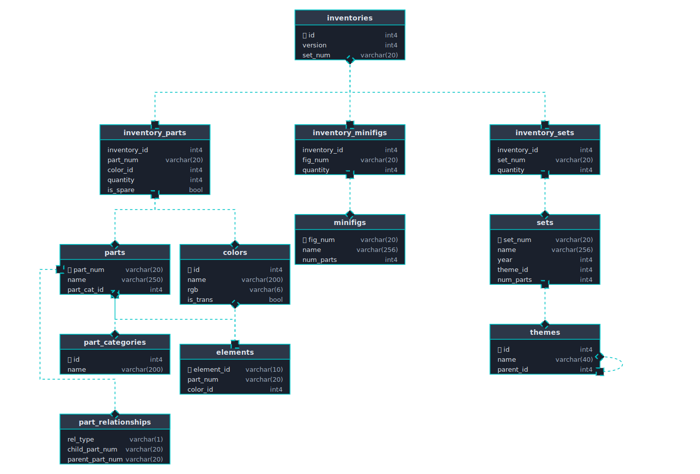

# LEGO Dataset Exploration

This project explores the LEGO catalog database available from Rebrickable.
  
`download_data.py` is a Python script to download all the data to a directory, it depends on `tqdm` and `requests` - run with `uv run ...` or `nix develop -c python ...`.  
## Dataset
From [Rebrickable](https://rebrickable.com/downloads/):
> The LEGO Parts/Sets/Colours and Inventories of every official LEGO set in the Rebrickable database is available for download as csv files here. These files are automatically updated daily.
  
> - This database stores only official LEGO items - Sets, Parts and Minifigs (no B-Models, Sub-Sets, MOCs)
> - Sets and Minifigs contain one or more Inventories `inventories.csv`
> - Inventories can contain Sets `inventory_sets.csv` and/or Parts `inventory_parts.csv` and/or Minifigs `inventory_minifigs.csv`
> - Part Relationship rel_types are: (P)rint, Pai(R), Su(B)-Part, (M)old, Pa(T)tern, (A)lternate

